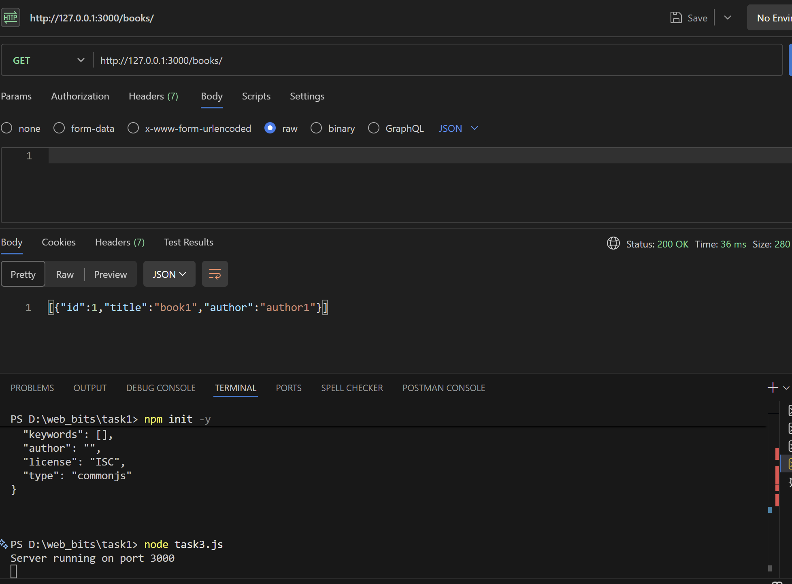
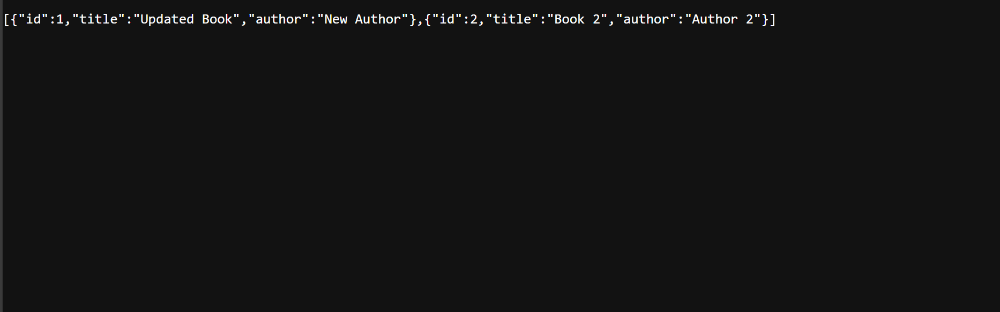
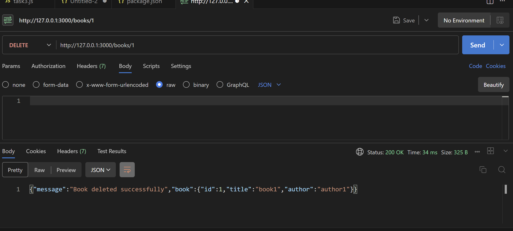

# TASK3
## Screenshots

### GET /books

### POST /books

### PUT /books/:id

### DELETE /books/:id

# Task 3 – Books REST API

## Description
This project is a simple REST API built using Node.js and Express to manage a list of books with CRUD operations.

## Features
- GET /books – Retrieve all books
- POST /books – Add a new book
- PUT /books/:id – Update a book
- DELETE /books/:id – Remove a book

## Tech Used
- Node.js
- Express.js
- Postman for testing

## How to Run
1. Install dependencies:
   npm install
2. Start server:
   node task3.js
3. Open:
   http://127.0.0.1:3000/books
